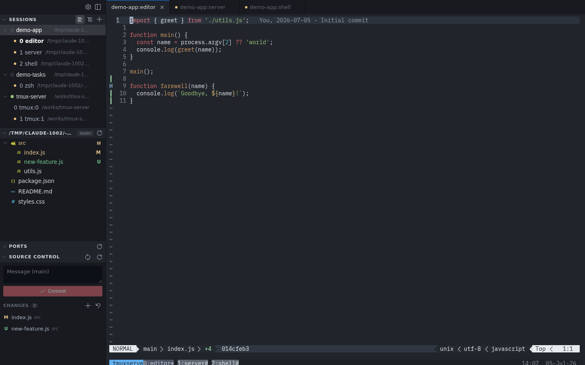
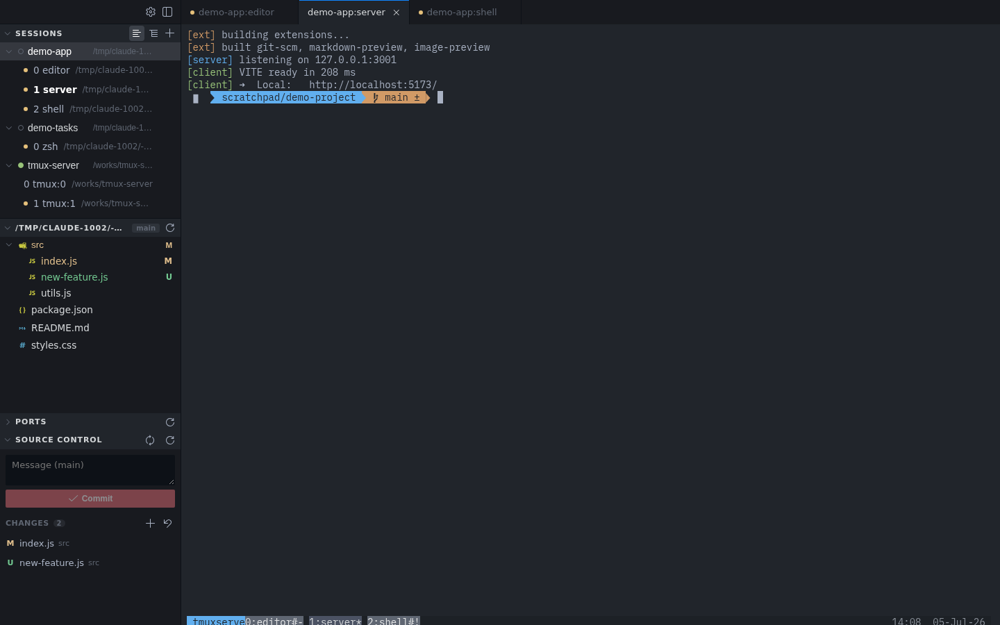
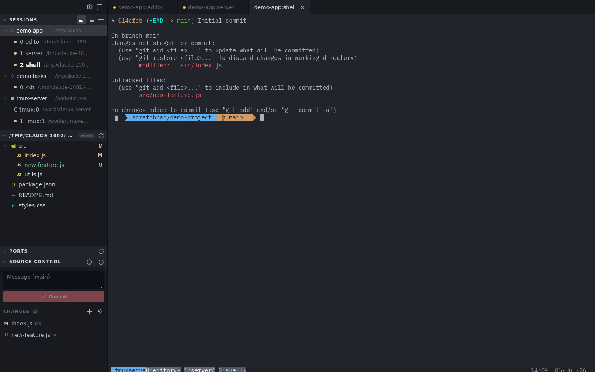
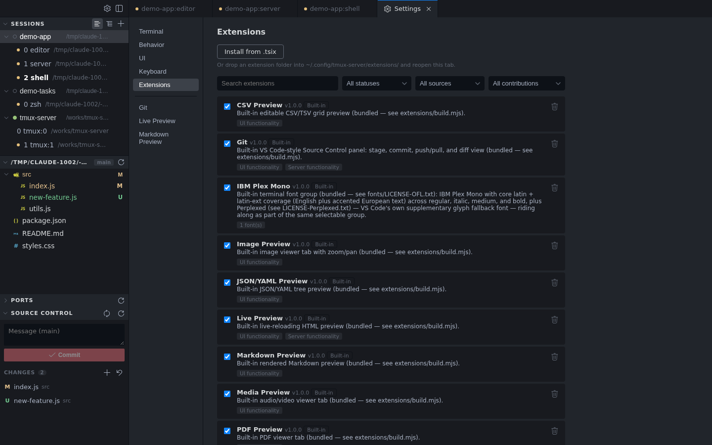
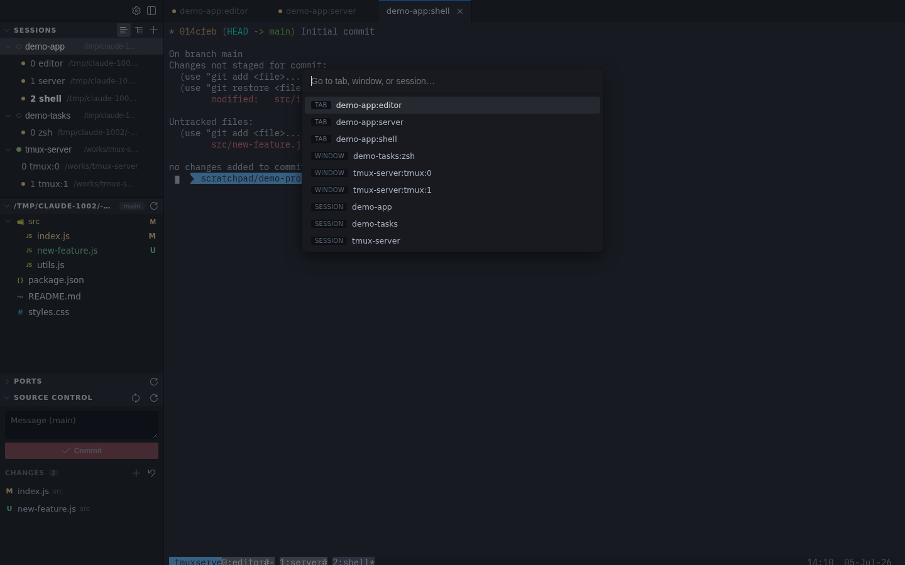

# Perch

**Your terminals, in a browser tab.** Perch turns the machine your code
actually runs on into a VS Code-style workspace you can open from any
browser - laptop, tablet, or phone.

Open a folder as a project and it gets its own terminal session. Run
`nvim`, `git`, a dev server, an AI agent. Close the laptop; the terminals
keep running in a daemon of their own, and come back with their history,
working directories and names after a server restart, a redeploy, a crash,
or a reboot.



<details>
<summary>More screenshots</summary>

| | |
|---|---|
|  |  |
|  |  |

</details>

## Why you'd want it

- **Terminals that outlive the browser.** A bundled daemon owns every
  terminal, so restarts, dropped connections and sleeping laptops cost you
  nothing. Scrollback replays exactly as it was written.
- **A real workspace, not just a shell.** Tabbed and split terminals, a file
  tree with drag-and-drop upload, source control, project-wide search,
  image/PDF/Markdown/CSV viewers, and `Ctrl+P` to jump anywhere.
- **Good on a phone.** Touch selection, a key bar for the keys phones don't
  have, swipe gestures, and zero-lag local echo when you're typing to an
  agent over a slow link.
- **Your editor, your keys, your theme.** `nvim` by default, VS Code color
  and icon themes installed unchanged, and every shortcut rebindable.
- **Ports, reachable.** The server lists what's listening and opens it in a
  tab, proxies it, or forwards it to your machine with one command.
- **AI agents as first-class citizens.** Claude Code and Codex are
  configured once and reused everywhere, with hooks written for you and
  push notifications when an agent needs an answer.
- **Extensible on purpose.** Nearly every surface above is itself a bundled
  extension, built on the same API your own extensions get.

See [docs/FEATURES.md](docs/FEATURES.md) for the full tour.

## Install

```bash
curl -fsSL https://raw.githubusercontent.com/tuanpham-dev/perch/main/install.sh | bash
```

On Windows, in PowerShell:

```powershell
irm https://raw.githubusercontent.com/tuanpham-dev/perch/main/install.ps1 | iex
```

This builds the app, installs a `perch` command, and starts a user service
that survives logout and comes back on boot. Perch is then at
<http://127.0.0.1:3001>. You need Node.js 23+ and a C/C++ toolchain; the
installer checks first and tells you what's missing.

Manage it with `perch start` / `stop` / `status` / `logs` / `update`, and
run `perch doctor` if anything looks wrong.

## Documentation

| | |
|---|---|
| [Features](docs/FEATURES.md) | What everything does, in detail |
| [Keyboard & mouse](docs/KEYBINDINGS.md) | Default shortcuts and terminal gestures |
| [Install](docs/INSTALL.md) | Requirements, the installer, and the `perch` CLI |
| [Deployment](docs/DEPLOYMENT.md) | Production, nginx, and authentication |
| [Port forwarding](docs/PORT_FORWARDING.md) | The tunnel CLI and the built-in port proxy |
| [Extensions](docs/EXTENSIONS.md) | Installing, bundling, and writing extensions |
| [Extension API](docs/EXTENSION_API.md) | The complete API reference |
| [Architecture](docs/ARCHITECTURE.md) | Why the core stays small |
| [Development](docs/DEVELOPMENT.md) | Running from a clone, and the repo layout |

## License

MIT - see [LICENSE](LICENSE).
